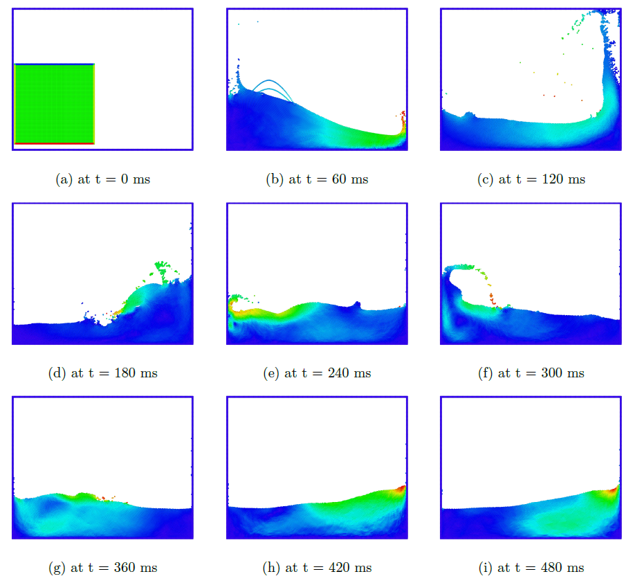

# Introduction
This project is developed for a course named - "Simulation in computer graphics" at University of Freiburg.
This skeleton uses [CMake](https://cmake.org/) and  automatically downloads [Eigen3](https://eigen.tuxfamily.org/) and
[Googletest](https://github.com/google/googletest).

To accomplish this course successfully, I cordially thank [Computer graphics department](https://cg.informatik.uni-freiburg.de/index.htm) to guide through the process. Also we use [Ovito](https://www.ovito.org/about/) to visualize our atoms and use  [Numpy](https://numpy.org/), [Matplotlib](https://matplotlib.org/) for plots.

# Visualization
In this animation, we show a simple solver with 3600 particles that uses pressurer boundaries.   
<p align="center">
  
</p>

This figure shows the snapshots of a SPH simulation of 400 particles. The stiffness constant is set to K = 30000, viscosity coefficient of ν = 18 and timestep Δt = 0.005 seconds
<p align="center">
  
</p>

This figure shows the snapshots of a SPH simulation of 1 million particles. The stiffness constant is set to K = 20000, viscosity coefficient of ν = 8 and timestep Δt = 0.005 seconds
<p align="center">
  
</p>

## Run
To run the project, navigate to the source code and create this directory,
```
mkdir build                                                         # Create a build folder
cd build                                                            # inside that folder
cmake ..                                                            # configure the cmake filer
make                                                                # build the project
./myproject                                                         # run the make file
tests/myproject_tests
```  